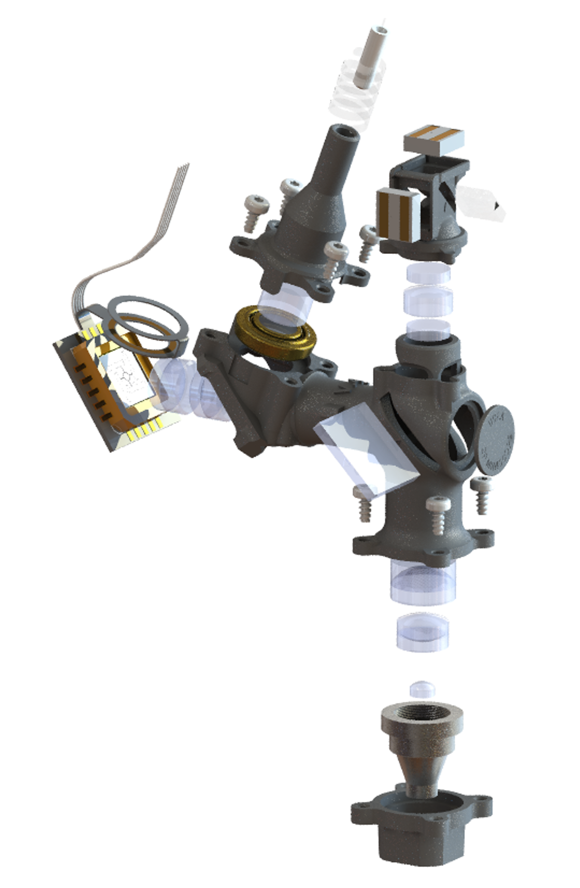

# UCLA 2P Miniscope 
UCLA miniature multiphoton microscope resources and design files.

The UCLA miniscope project is an open-source inititive to design open-source miniature microscopes for neuroscience. Here, we present a multiphoton miniature microscope developed at UCLA which is able to record from fine structures like dendrites, or several hundred microns into tissue. 
  

In this Git repository, we openly share all of the design files for this microscope with the community, these include:  
  - Mechanical Design Files (in .STEP format)
  - Optical Design Files (ZEMAX .ZARs)
  - Electronic PCB Designs (GERBER)
  - Control Software (Matlab and Waveforms)

 
As well as additional information to support users in setting up these devices, such as:

  - Suite2P analysis .ops to aid in analysis
  - A pre-trained DeepLabCut Network
  - ScanImage Machine Data Files and Configuration files
 

For additional information, please take a look at our bioRxiv paper [here](https://www.biorxiv.org/content/10.1101/2024.03.29.586663v1)
 
We also provide the following resources regarding data avialability and processing:
For a folder full of Demo resources, please visit the [Demo](https://ucla.box.com/s/3wto9k1oq8evrciismuwrfbsespp461s) UCLA Box Repository.
  - System Requirements:  
To analyze the data we generate, four softwares are used, [FIJI/Imagej](https://imagej.net/software/fiji/) v.1.54f, [Suite2P](https://github.com/MouseLand/suite2p) v.0.9.2, [DeepLabCut](https://github.com/DeepLabCut/DeepLabCut) v.2.3.8, [MATLAB](https://www.mathworks.com/products/matlab.html) (v.2022b). Any relatively modern windows or apple computer should be capable of running all of these softwares without technical limitations, although a CUDA-compatible GPU is very useful for DeepLabCut. Otherwise consider installing the apple silicon specific version of DeepLabCut. For this work, we tested the analysis pipeline with x64 Windows 10 Pro, v.22H2. The analysis can be completed using standard hardware, we used a Windows Book 2 from 2018 with an Intel Core i7-8650U CPU and 16BG of RAM. 

  - Software Installation Guide:  
Processing the data relies on well-documented software packages as well as two custom softwares. The first is a FIJI/ImageJ macro titled "Preprocess.imj" which can be installed from FIJI/ImageJ by selecting from the main toolbar "Plugins" > "Macros" > "Install" and navigating to the "Preprocess.imj" file. If you are a heavy user that anticipates routinely analyzing data, the contents of "Preprocess.imj" can be copied from the Edit Macros menu and added to the end of the "Startup Macros" file so it is installed when FIJI/ImageJ is initialized. To do so, select "Plugins" > "Macros" > "Edit" and navigate to Fiji.app\macros\StartupMacros.fiji.ijm and add the contents of "Preprocess.imj" to the end of the file. Save the file and restart Fiji/Imagej. This way the macro is installed and able to be run from the "Plugins" > "Macros" menu without installing each time.

Please reference the Suite2P, DeepLabCut, and MATLAB installation guides for assistance getting these softwares operational. The MATLAB file "SpatialFiring.m" can be run from any suitable MATLAB directory so long as "Fall.mat" and "Behavior_ExampleDLC_resnet50_2P_Miniscope_2Dec5shuffle1_100000_filtered.csv" are also present in that same directory, should you want to understand the method used in order to check the spatial firing properties of neurons within the UCLA 2P Miniscope FOV.

The total install time for the custom code is only a few minutes, installing the other standalone software can be installed within a few hours. 
    
  - Demo:  
Once the data is collected, there are several steps to complete the analysis. We will explain the general implementation of these steps through an example which involves processing the calcium imaging data, behavioral data, and integrating the results with a MATLAB script. 
1. First, we will condiser the calcium data. Load the .tif file "Example_Data.tif" located in the [Demo](https://ucla.box.com/s/3wto9k1oq8evrciismuwrfbsespp461s) box link, that was generated by ScanImage, into FIJI/ImageJ and preprocess using the provided "Preprocess.imj" macro. Users can also deinterleave image channels at this time. In the case of the demo, please select deinterleave on "Example_Data.tif" since it contains information from both SiPM channels. Once processed, save dynamic iamge stack (should be called "Example_Data-1.tif #1") as a .tiff ("File" > "Save As" > "Tiff"). Next initilize Suite2P v.0.9.2 and navigate to "File" > "Run Suite2P". Next, load the predefined ops.npy file in the "Load ops file" window and define the data_path field to where you saved the .tif file. Small modifications to parameters might be needed for your specific use case, these are general and what worked well in our hands. Next click "RUN SUITE2P" and wait until all data is processed. Within the "save_path" directory, there will be a "Fall.mat" file contained in the "suite2p" > "plane0" folder which we will then process. Screenshots of the expected output are included within the Demo folder as "Demo_S2P_Output.PNG". 
2. Next, analyze the time-synchronized example behavior video "Behavior_Demo.avi" with DeepLabCut. For this example, the calcium and behavior videos are not aligned. If this is your first time, please review the excellent documentation found [here](https://deeplabcut.github.io/DeepLabCut/docs/installation.html) to label data and build a trained model. We have included a pre-trained network that we used for image classification of the location of the miniscope headpiece, but it may be necessary to build your own model depending on your specific experimental conditions. Output files "Behavior_ExampleDLC_resnet50_2P_Miniscope_2Dec5shuffle1_100000_filtered.csv" are provided along with an annotated video describing the DeepLabCut outputs. Once complete, navigate to the "video" directory of your DLC model and select the DLC output .csv file and place in the same directory as the "SpatialFiring.m" file. We provide this processed .csv file as "Behavior_ExampleDLC_resnet50_2P_Miniscope_2Dec5shuffle1_100000_filtered.csv" within the "Demo" > "Expected Outputs" > "DeepLabCut" folder. 
3. Now that the calcium imaging and behavior data are analyzed, we can put the two together and assess the firing properties of individual neurons as a function of location in the behavioral chamber and time. For this purpose use the "SpatialFiring.m" file included in this repository and to the same directory add the "Fall.mat" and the output of the DLC process, which in the uploaded example is called "Behavior_ExampleDLC_resnet50_2P_Miniscope_2Dec5shuffle1_100000_filtered.csv." This will compute the spatial firing properties of the neural traces from "Fall.m" based on the spatial coordinates found in the "Behavior_ExampleDLC_resnet50_2P_Miniscope_2Dec5shuffle1_100000_filtered.csv" file.

We also provide in the [Demo](https://ucla.box.com/s/3wto9k1oq8evrciismuwrfbsespp461s) folder, the expected output from the analysis described above. The preprocessing step in FIJI/Imagej took approximately 2 minutes to complete, Suite2P analysis took 7 minutes with all of the registration steps and ROI extraction for the 1000 frames of the first channel from the "Example_Data.tif" demo file. DeepLabCut took approximately 4 minutes to process the "Example_Behavior.mp4" video on a computer fitted with an NVIDIA GeForce 1060 GPU. 
    
  - Instructions For Use:  
The demo section of this GitHub repo is intended to explain how to use the software through a concrete provided example. Any user can replace the example microscope imaging data and behavioral video, to reproduce the same sorts of outputs that are described in the manuscript.  
 
Here are some fancy images that show off what the microscope is capable of!
 
This is a densely-labled CA1 expressing GCaMP7f.

  
 
This is RSC expressing GCaMP6f and an mCherry c-Fos reporter.
 

 
This is an exploded view of the microscope, including all of the mechanical and optical components.  
 

